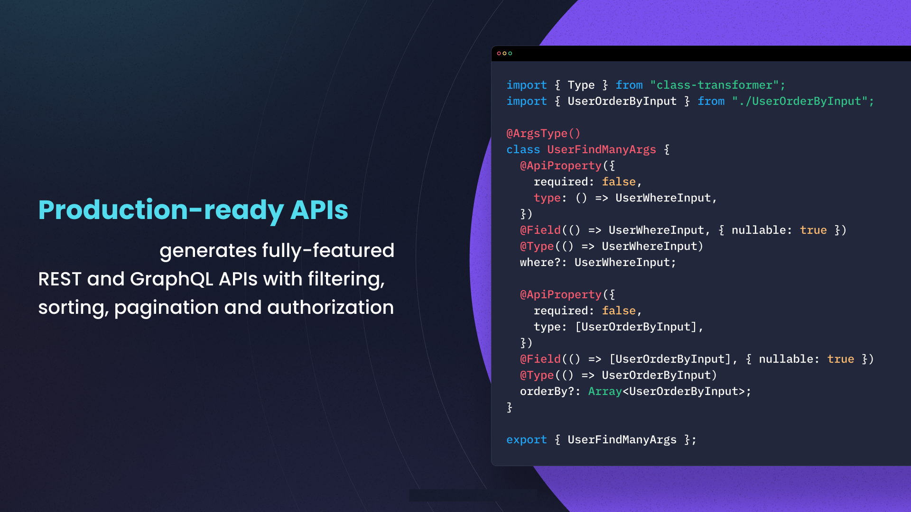
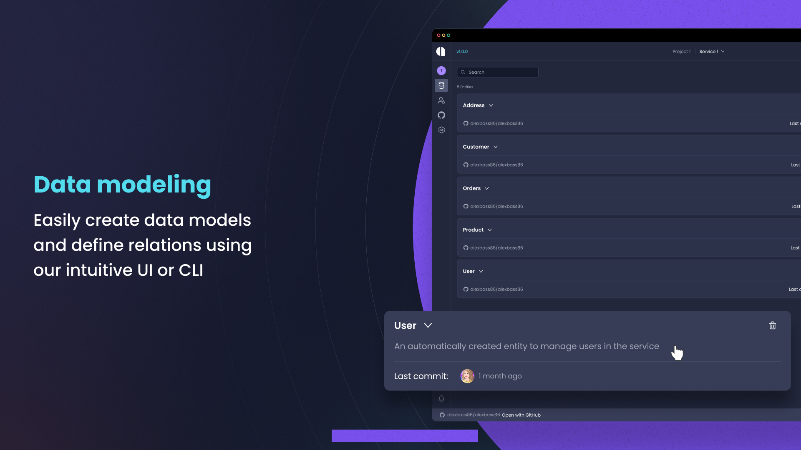
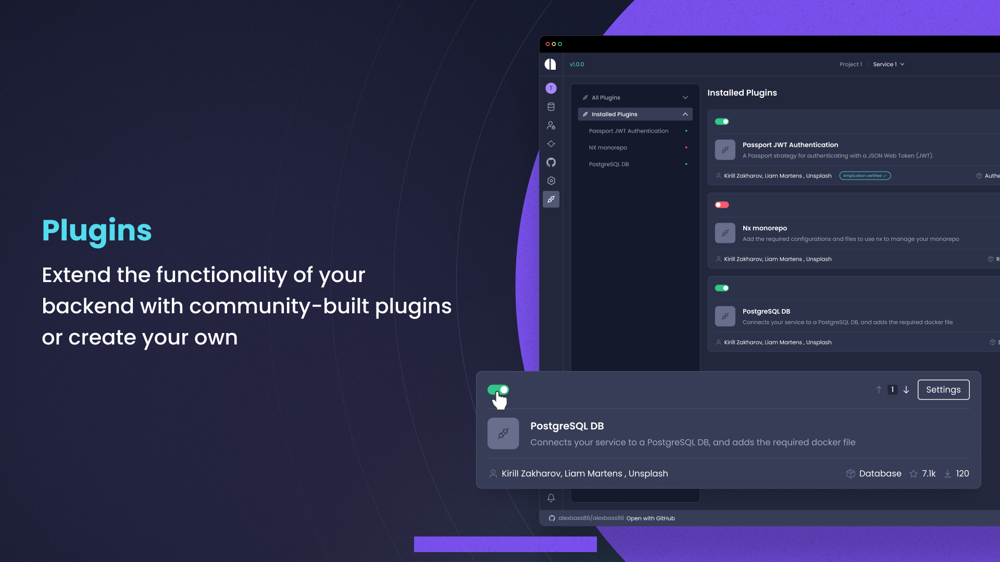
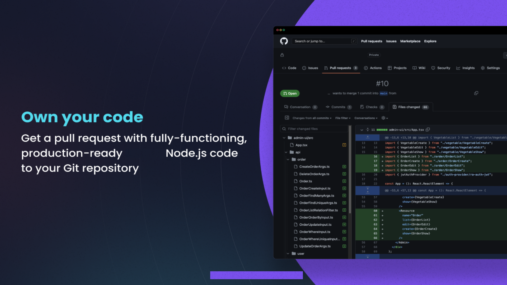
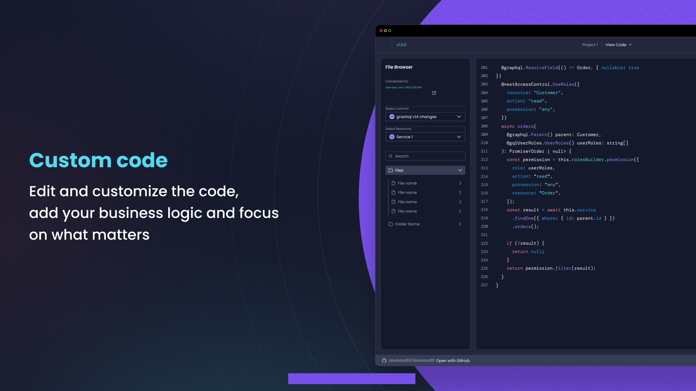

<h1 align="center">
    <a href="https://applycreatures.com">
    
    </a>
</h1>

<p align="center">
  <i align="center">A place with some of the open sourced creatures 🐺 </i>
</p>

<h4 align="center">
  <a href="https://github.com/apply-creatures/.github/actions/workflows/ci.yml">
    
  </a>
  <a href="https://github.com/apply-creatures/.github/graphs/contributors">
    
  </a>
  <a href="https://opensource.org/licenses/Apache-2.0">
    
  </a>
  <br>
  <a href="https://applycreatures.com/discord">
    
  </a>
  <a href="https://twitter.com/applycreatures">
    
  </a>
  <a href="https://www.youtube.com/c/applycreatures">
    
  </a>
</h4>


<p align="center">
    
</p>


## Introduction

`Apply Creatures` aims to open-source some of its application development. A platformed designed as scalable and secure applications. We automate your backend applications development, ensuring consistency, predictability, and adherence to the highest standards with code that’s built to scale

Our user-friendly interface fosters seamless integration of APIs, data models, databases, authentication, and authorization. Built on a flexible, plugin-based architecture, Apply Creatures allows integration and customization of the code initially tailored for our own needs. 

With a strong focus on collaboration, Apply Creature internally streamlines team-oriented development, making it an ideal choice for groups with special needs.

<details open>
<summary>
 Features
</summary> <br />

<p align="center">
    
&nbsp;
    
</p>

<p align="center">
    
&nbsp;
    
</p> 
    
<p align="center">
    
&nbsp;
    
</p>

</details>

## Usage 

To get started with Apply Creature, the hosted version of the component can be used. You can get started immediately after this URL resolves: [api.applycreatures.com](https://api.applycreatures.com). After the login page, you will be guided through creating your API key. The [website](https://applycreatures.com) provides an overview of the application, additional information on the product and guides can be found in the [docs](https://docs.applycreatures.com).

<details>
<summary>
  Tutorials
</summary> <br />

- [To-do application using a Creature and React](https://docs.applycreatures.com/tutorials/react-todos)
</details>

## Development

Alternatively, instead of using the hosted version of the product, Apply Creatures may (partly) run locally for code generation purposes or contributions - if so, please refer to our [contributing](#contributing_anchor) section.

<details open>
<summary>
Pre-requisites
</summary> <br />
To be able to start development of a Creature, make sure that you have the following prerequisites installed:

###

- Node.js
- Docker
- Git
</details>

<details open>
<summary>
Running a Creature component
</summary> <br />

> **Note**
> It is also possible to start development with GitHub Codespaces, when navigating to `< > Code`, select `Codespaces` instead of `Local`. Click on either the `+`-sign or the `Create codespace on master`-button.

Creatures are likely using needing nodejs, TypeScript. Some may require Docker.

**BEFORE** you run the following steps make sure:
1. You are using a supported node version (check `engines` `node` in the [package.json](./package.json))
2. You are using a supported npm version (check `engines` `npm` in the [package.json](./package.json))
3. You have `docker` installed and running on your machine


1. Clone the repository and install dependencies:
```shell
git clone https://github.com/apply-creatures/someapplication.git && cd someapplication && npm install
```

2. Run the setup script, which takes care of installing dependencies, building packages, and setting up the workspace:
```shell
npm run setup:dev
```

3. Option 1: Running the required infrastructure - view infrastructure component logs


```shell
npm run docker:dev
```
3. Option 2: Running the required infrastructure - run the infrastructure components in background
```shell
npm run docker:dev -- -d
```

4. Apply database migrations
```shell
npm run db:migrate:deploy
```

5. To start developing, run one or more of the applications available under `serve:[application]` scripts of the package.json.

```shell
# running the server component
npm run serve:server

# running the client component
npm run serve:client

# running the data-service-generator component
npm run serve:dsg

# running the git-sync-manager component
npm run serve:git

# running the plugin-api component
npm run serve:plugins
```

> **Note**
> In order to run some creaturec client properly, both the client and server need to be started by the `npm run serve:[application]` command, as well as an additional component for development on a specific component.

The development environment should now be set up. Additional information on the different application components can be found under packages/`[application]`/README.md file. Happy hacking! 👾
</details>

## Resources

- **[Website](https://applycreatures.com)** overview of the product.
- **[Docs](https://docs.applycreatures.com)** for (not really but almost) comprehensive documentation.
- **[Blog](https://blog.applycreatures.com)** for guides and technical comparisons.
- **[Discord](https://applycreatures.com/discord)** for support and discussions with the community and the team.
- **[GitHub](https://github.com/apply-creatures)** for source code, project board, issues, and pull requests of all repositories
- **[Twitter](https://twitter.com/applycreatures)** for the latest updates on the product and published blogs.
- **[YouTube](https://www.youtube.com/c/applycreatures)** for guides and technical talks.

<a name="contributing_anchor"></a>
## Contributing

Part of Apply Creatures code is open-source. We are committed to a transparent development process and highly appreciate any contributions. Whether you are helping us fix bugs, proposing new features, improving our documentation or spreading the word - we would love to have you as a part of the Apply Creatures community. Please refer to our [contribution guidelines](./CONTRIBUTING.md) and [code of conduct](./CODE_OF_CONDUCT.md).

- Bug Report: If you see an error message or encounter an issue while using a Creature, please create a [bug report](https://github.com/apply-creatures/.github/issues/new?assignees=&labels=type%3A+bug&template=bug.yaml&title=%F0%9F%90%9B+Bug+Report%3A+).

- Feature Request: If you have an idea or if there is a capability that is missing and would make development easier and more robust, please submit a [feature request](https://github.com/apply-creatures/.github/issues/new?assignees=&labels=type%3A+feature+request&template=feature.yml).

- Documentation Request: If you're reading the apply creatures docs and feel like you're missing something, please submit a [documentation request](https://github.com/apply-creatures/.github/issues/new?assignees=&labels=type%3A+docs&template=documentation-request.yaml&title=%F0%9F%93%96+Documentation%3A+).

Not sure where to start? Join our discord and we will help you get started!

<a href="https://applycreatures.com/discord"></a>

## Contributors

<!---
npx contributor-faces --exclude "*bot*" --limit 70 --repo "https://github.com/apply-creatures/.github"

change the height and width for each of the contributors from 80 to 50.
--->

[//]: contributor-faces
<a href="https://github.com/hirako2000"></a>
